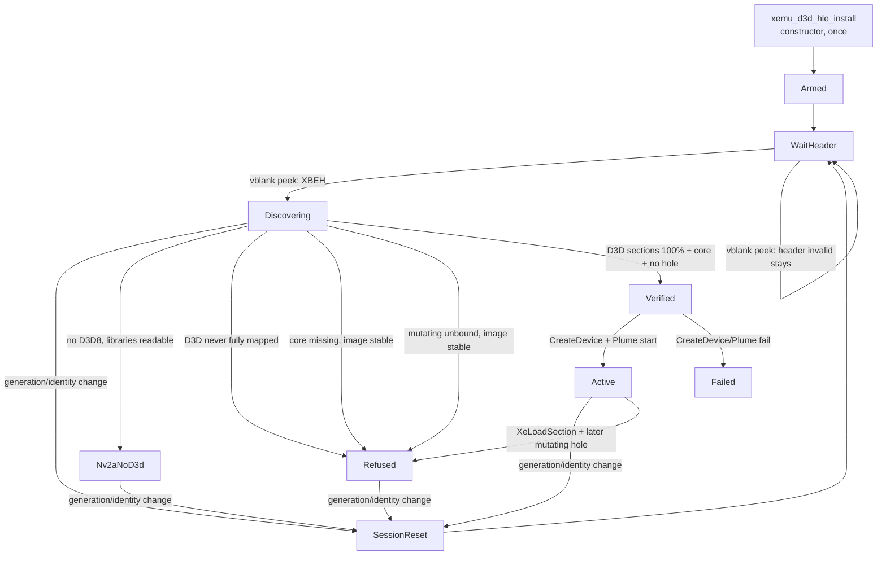

# Universal Plume D3D8 Setup

| Field | Value |
|---|---|
| Title | Universal Plume D3D8 Setup |
| Author | XemuPlume / D3D HLE |
| Date | 2026-08-18 |
| Status | Draft |
| Companion | `hw/xbox/d3d_hle/README.md` (path that exists today) |

Design for attaching the experimental Plume D3D HLE frontend to every XBE
xemu loads, automatically, without a per-title profile.

This is the target architecture. `README.md` describes the path that exists
today. A successful signature scan is not gameplay proof; that rule is
unchanged. A senior engineer in this tree should be able to implement from
this document without inventing policy.

Do not treat this as a greenfield product. The working (title-shaped)
implementation in `xemu_d3d_hle.c` / `xemu_d3d_hle_discovery.c` is the
starting point. Exact-profile overrides in `xemu_d3d_hle_mm3.c` and
`xemu_d3d_hle_pgr2.c` stay.

## Overview

Plume is opt-in (`XEMU_D3D_FRONTEND=hle` or View > Backend > Plume) and
already has runtime XDK discovery (`xemu_d3d_hle_discover`). Setup is still
title-shaped: one-shot PRELOAD scan on the first in-image TCG PC, arity
equality in `find_binding`, no session reset on dashboard → title, and
`xemu_d3d_hle_profiles_validate` as a process-wide kill switch.

The XBE file is the wrong unit. The unit is the **D3D8 instance the title
actually linked**. Setup must track that instance for the life of the
process: reset when the loaded identity changes (including same-image
relaunch), rescan when executable pages become real, bind by canonical
API (CreateDevice ABI is the only projection in this design), classify
every detected function, and refuse the split-renderer case.

Success for this design is binary per load:

- Plume owns the GPU-mutating D3D surface for that linked XDK, or
- NV2A stays in charge, with a named reason.

Universal playability (every D3D mutation implemented in Plume) is HLE
completeness and out of scope.

Two process-lifetime clocks make the session implementable against this
tree:

1. **NV2A vblank identity/header peek** (before the `s_host_ready`
   early-out), queued to CPU0 only on change. Live in every
   non-`Disabled` state.
2. **Observe-only `XeLoadSection` / `XeUnloadSection`**, resolved once
   from the **kernel PE export table** (ordinal `0x0147` / `0x0148`)
   after `xboxkrnl` is mapped, hooked via a **second TCG intercept**
   (`exec_loader_pc[2]` + `exec_loader_return_pc` on `CPUState`). Not
   unioned into the user-space hook range.

## Background & Motivation

### Current attach path

`xemu_d3d_hle_install` (`hw/xbox/d3d_hle/xemu_d3d_hle.c`) is called once
from `xbox_init_common` in `hw/xbox/xbox.c` immediately after
`xbox_memory_init`. It is a constructor. If `XEMU_D3D_FRONTEND=hle` or
`g_config.display.d3d_frontend == CONFIG_DISPLAY_D3D_FRONTEND_PLUME`, it:

1. Calls `xemu_d3d_hle_profiles_validate`. On failure it sets
   `XEMU_D3D_HLE_STATUS_FAILED` and returns — **no title, automatic or
   otherwise, can attach**.
2. Calls `xrecomp_d3d_frontend_initialize_value` (meson defines
   `XRECOMP_D3D_HLE_RUNTIME_READY=1` and related readiness macros in
   `hw/xbox/meson.build` lines 48–54).
3. Installs a TCG board intercept on CPU0:
   `exec_entry_min_pc = 0x00010000`, `exec_entry_max_pc = 0x07FFFFFF`,
   `exec_entry_check = xemu_d3d_hle_is_entry`,
   `exec_entry_callback = xemu_d3d_hle_exec`.

The intercept lives in `accel/tcg/cpu-exec.c` (lookup-and-goto bypass)
and `accel/tcg/translator.c` (`translator_use_goto_tb`). Every PC in
`[exec_entry_min_pc, exec_entry_max_pc]` invokes `exec_entry_check`. The
chained lookup path is left **only when that check returns true** (or
when `pc == exec_entry_return_pc`). After discover, that is
`xemu_d3d_hle_profile_find_hook != NULL`, not every user-space PC.

`xemu_d3d_hle_is_entry` / `xemu_d3d_hle_resolve_loaded_xbe` then:

1. Wait until TCG is translating a PC inside the loaded image
   (`xemu_d3d_hle_pc_is_in_loaded_xbe`: magic `XBEH` at `0x10000`,
   `dwBaseAddr == 0x10000`, `pc ∈ [base+headers, base+image)`).
2. Try exact MM3/PGR2 fingerprints (`xemu_d3d_hle_select_profile` /
   `xemu_d3d_hle_validate_profile`).
3. Else call `xemu_d3d_hle_discover`. On `retryable` and
   `s_discovery_retry_attempts < 8`, sleep
   `min(100 << min(retry-1, 3), 1000)` ms and try again.
4. Freeze `s_profile`. Never look again. `s_profile_checked` is never
   cleared.

Discovery (`xemu_d3d_hle_discover`) snapshots **PRELOAD** sections only
(`XBE_SECTION_HEADER_FLAGS_PRELOAD`), zero-fills unread pages, and asks
XbSymbolDatabase to scan `XBSDBLIB_D3D8 | XBSDBLIB_D3D8LTCG`. A symbol
binds only when `canonical_name_length` plus **exact**
`param_count == binding->param_count` match `bindings[]`.
`xemu_d3d_hle_invoke_discovered` additionally requires
`source_param_count == target_param_count`. Unbound functions stay native.

`xemu_d3d_hle_vblank` (`nv2a.c` `nv2a_vga_gfx_update` →
`xemu_d3d_hle_vblank`) **returns immediately** when `!s_host_ready`.
That early-out is why today's NV2A vblank cannot clock WaitHeader /
Nv2aNoD3d.

### Pain points this design exists to close

| Symptom | Cause in this tree |
|---|---|
| Dashboard → title keeps the dashboard hook table | `s_profile_checked` is sticky; `xemu_d3d_hle_install` is once-per-process |
| Forza / demand-loaded D3D races the loader | First-PC + eight sleeps; PRELOAD-only snapshot |
| LTCG CreateDevice (3-arg) is special-cased; other elisions miss | `find_binding` arity equality |
| "Plume active" on titles still writing PGRAPH | Unbound mutating symbols execute native XDK |
| Stale MM3/PGR2 registry disables every title | `profiles_validate` at install |
| 128 MiB TCG gate for the whole run | Wide range exists only so discovery can fire |

Offline detector evidence already listed in `README.md` (RalliSport
Challenge 2, Forza, Halo 2, Sega GT 2002/Online) is **not** live
intro/menu/gameplay validation. MM3 has that validation. This design does
not promote detector evidence into proof.

## Goals & Non-Goals

### Goals

- Every xemu load that opts into Plume automatically does one of two
  things, repeatably:
  - **Plume owns** the GPU-mutating D3D surface for the linked XDK, or
  - **NV2A stays in charge**, with a named reason.
- The unit of setup is the linked D3D8 instance, tracked as a live session.
- A process-lifetime event source is live in every non-`Disabled` state.
- Discovery is driven by mapping (header valid, `XeLoadSection` commit,
  D3D-named section coverage), not by first-PC + eight sleeps as the
  primary mechanism.
- Bind by canonical API name. CreateDevice is the only ABI-projection
  case in this design. `param_psh2` / `param_count>8` are uncovered.
- Classify every detector-reported function with an ordered rule.
  Uncovered mutating ⇒ refuse after the image is stable.
- Exact MM3/PGR2 profiles remain compatibility overrides. Validate each
  profile independently; a broken PGR2 must not disable MM3 or automatic.
- Existing runtime-proof contract stays (UI Active string + log lines).

### Non-goals

- Authoring or growing a per-XBE fingerprint registry.
- Claiming visual, shader, or frametime parity from a successful scan.
- Forcing software rasterizers or raw-pushbuffer titles through Plume.
- Replacing MM3/PGR2 exact profiles.
- Implementing every Xbox D3D8 API. Adding a wrapper for an uncovered
  mutating symbol is coverage work, not another setup special case.
- A general LTCG-default table for APIs other than CreateDevice.
- KVM. The TCG intercept is TCG-only (`#ifdef XBOX` in `cpu-exec.c` /
  `translator.c`).

### Two products

| Goal | Meaning | This design |
|---|---|---|
| Universal attach | Every XBE that links a known XDK D3D8 gets a live hook table and a Plume device, or is cleanly left on NV2A | In scope |
| Universal playability | Every D3D mutation that would have hit NV2A is implemented in Plume with correct guest semantics | Out of scope. HLE completeness. |

Homebrew that does not link a known D3D8, and titles that poke NV2A without
D3D, stay on NV2A. That is the correct universal behavior, not a failure.

PR 4 will refuse most retail D3D8 images that today's automatic path
would arm, because XbSDB reports symbols **present in the linked image**
(`D3DDevice_Present`, `BeginPush`, `SetLight`, `CDevice_SetStateVB`, …)
and those names are mutating-unbound until a wrapper exists. That
attach-rate cliff is owned: it is attach honesty, not a regression to
paper over.

## Proposed Design

Treat discovery as a **live session**, not a boot event.



### Process-lifetime event sources

These two clocks exist in **every** non-`Disabled` state, including
`WaitHeader`, `Nv2aNoD3d`, `Active`, `Refused`, and `Failed`. They are
the only reason dashboard → title, same-image relaunch, and
refuse-after-active are implementable.

#### Clock A — NV2A vblank header/identity peek

`nv2a_vga_gfx_update` already calls `xemu_d3d_hle_vblank` every emulated
vblank, including before Plume is Active.

**Change `xemu_d3d_hle_vblank`:** do **not** return on `!s_host_ready`
before the peek. Two flags, one CPU0 callback:

| Flag | Meaning |
|---|---|
| `s_session_work_queued` | Clock A saw a header/identity/generation change or a pending kernel-resolve. May be set when `!s_host_ready`. |
| `s_vblank_queued` | Present work. Set only when `s_host_ready` is true at the peek. |

`nv2a` thread: peek, set the appropriate flag(s), `async_run_on_cpu`
at most once if either flag went false→true.

CPU0 callback, **fixed order**:

1. Apply queued session events (`E_HeaderInvalid`, `E_HeaderValid`,
   `E_IdentityChanged`, `E_GenerationBump`, kernel-resolve retry).
   This may call `d3d_hle_guest_reset_session()` and clear `s_host_ready`.
2. Present (`xemu_d3d_hle_service_vblank`) **only if** `s_host_ready`
   is still true after step 1.

Do not present first. Do not reuse `s_vblank_queued` for identity
work: a `!s_host_ready` title switch must still queue session work,
and an Active frame must not drop a present just because identity
was unchanged.

**Cheap peek** (no XbSDB, no scan):

1. If `!s_requested || !s_cpu`: return.
2. Try `xemu_d3d_hle_read_u32(0x10000, &magic)`.
3. If readable and `magic == XBEH`, read the identity triple
   (`dwTimeDate` at `0x10114`, `dwSizeofImage` at `0x1010C`,
   `dwTitleId` at `cert+8`). Optionally also read `dwEntryAddr`
   (`0x10128`) and `pCertificateAddr` (`0x10118`) as a **best-effort
   extra**. After kernel decode those two fields are the same for
   the same XBE; they are **not** a reliable same-image stamp.
   Do **not** require a sampled invalid gap.
4. If kernel loader VAs are not yet cached, try
   `xemu_d3d_hle_try_resolve_kernel_loader()` (conventional
   `0x80010000`; see Clock B). One MZ/PE read, then stop.

The vblank thread must not mutate the session. CPU0 owns all transitions.

This is the WaitHeader clock at boot (install runs in `xbox_init_common`
before any XBE exists). It is also the Nv2aNoD3d / Refused / Failed
clock after the user-space hook gate is idle.

#### Clock B — process-lifetime `XeLoadSection` observe-hook

Resolve **once** from the guest `xboxkrnl` **PE export table**, not from
the title IAT.

| Item | Value |
|---|---|
| Kernel image VA | Conventional retail/debug `xboxkrnl` base **`0x80010000`**. This constant is **not** named anywhere under `hw/xbox/` today. |
| Export | name `XeLoadSection` first; ordinal `0x0147` is fallback only (`XREF_KT_FUNC_XeLoadSection`) |
| Pair | name `XeUnloadSection` first; ordinal `0x0148` fallback |
| Lifetime | process. Do **not** re-resolve per XBE. |
| Body | native. Observe entry + return only. |
| Chihiro | **Out of scope** unless a later note says otherwise (different kernel base / XOR). |

**Resolve algorithm** (`xemu_d3d_hle_try_resolve_kernel_loader`):

1. `xemu_d3d_hle_read(0x80010000, dos, 64)`. If unmapped or `e_magic`
   is not `MZ`, return false and retry on the next Clock A peek.
   After the dashboard has been up (header-valid seen at least once)
   and MZ is still missing, log a **one-time** loud warning
   `[D3D-HLE] no MZ at 0x80010000; XeLoadSection watch not armed`.
   Do not hang. Clock A still drives identity; Discovering can still
   time out on host monotonic 5 s.
2. Read `e_lfanew`, then `IMAGE_NT_HEADERS32` export directory
   (`IMAGE_EXPORT_DIRECTORY`).
3. **Names first.** Walk `AddressOfNames` / `AddressOfNameOrdinals` /
   `AddressOfFunctions` for `"XeLoadSection"` and `"XeUnloadSection"`.
4. **Ordinal fallback only if a name is missing:**
   `AddressOfFunctions[ordinal - export->Base]`
   (`0x0147 - Base`, `0x0148 - Base`). Do **not** use the ordinal as
   a raw `AddressOfFunctions` index.
5. Cache the two function VAs. Write non-zero values into
   `cpu->exec_loader_pc[0]` / `[1]`. Leave a slot 0 if that export
   failed.
6. Log `[D3D-HLE] kernel loader base=%u XeLoadSection=%08X XeUnloadSection=%08X`.

There is **no** xboxkrnl export parser in `hw/xbox/` today. This helper
is new and lives next to the session. Title IAT
(`XbSDB_GetKernelThunkAddress` + walk) is a **secondary hint only**
(debug log if it disagrees). After the kernel patches the IAT,
`*kt & 0x7FFFFFFF` is a kernel address, not the ordinal — that is why
IAT-at-header-valid is a race and is **not** the primary resolve.

**On `XeLoadSection` entry** (loader intercept, not the D3D hook
callback's pending path):

- Snapshot stdcall arg0 (`PXBESECTION` → `xbe_section_header`:
  `dwVirtualAddr`, `dwVirtualSize`, `dwSizeofRaw`, `dwFlags_value`).
- Snapshot **`loader_entry_span_mapped`:** walk
  `[dwVirtualAddr, dwVirtualAddr + dwSizeofRaw)` with
  `xemu_d3d_hle_translate`. True only if **every** page already
  translates. This is how a refcount increment is distinguished
  from a real remap: guest `XeLoadSection` of an already-resident
  section succeeds and only increments `dwSectionRefCount`.
- Set `cpu->exec_loader_return_pc` to the guest return PC. Do **not**
  use `exec_entry_return_pc` (that field is owned by CreateDevice /
  lock / GetBackBuffer2 mirrors).

**On `exec_loader_return_pc`:**

- If EAX is a successful `NTSTATUS`, apply **exactly one** of:
  1. **`loader_entry_span_mapped`** → refcount increment. Do
     **not** bump generation. Do **not** fire `E_SectionCommit`
     (coverage unchanged). Common while Active: `XLoadSection` /
     `XLoadSectionByHandle` on resident PRELOAD `D3D` / `.text`.
  2. Else if PRELOAD **and** (session coverage for that section
     was already `>= dwSizeofRaw` this generation **or** state is
     `Verified` / `Active` / `Nv2aNoD3d` / `Refused` / `Failed`)
     → `E_GenerationBump`. Span was unmapped at entry: a
     same-image relaunch remapped PRELOAD this generation already
     finished (or the session is past first Discovering).
  3. Else → `E_SectionCommit` (first map of that span this
     generation, including first Discovering PRELOAD).
- Clear `exec_loader_return_pc` and `loader_entry_span_mapped`.

`XeUnloadSection` success clears coverage bits for that span
(pages no longer translate). That makes the next PRELOAD
`XeLoadSection` see `loader_entry_span_mapped == false`.

### TCG intercept: two gates

`CPUState` (`include/hw/core/cpu.h`) today has **one** inclusive range
plus **one** `exec_entry_return_pc`. Unioning `XeLoadSection`
(`0x800xxxxx`) into the user-space hook range would span ~2 GiB. That
is worse than today's 128 MiB gate and is rejected.

**Required `cpu.h` addition** (exact fields):

```c
#ifdef XBOX
    /* existing: exec_entry_callback, exec_entry_check, opaque,
     * exec_entry_min_pc, exec_entry_max_pc, exec_entry_return_pc */

    /* Second board intercept: at most two discrete kernel PCs
     * (XeLoadSection / XeUnloadSection). Zero means unused.
     * Never a min/max range — the two exports are not a tight span. */
    vaddr exec_loader_pc[2];
    vaddr exec_loader_return_pc;
#endif
```

**`accel/tcg/cpu-exec.c`:** today's block is gated on
`exec_entry_callback` **and** the range side also requires
`exec_entry_check`. Clock B is dead if either is NULL. Required
shape — discrete loader PCs **outside** `exec_entry_check`, and
compared only when the slot is non-zero (PC 0 is a real guest
address; an unused slot must not match it):

```c
if (unlikely(cpu->exec_entry_callback)) {
    if (s.pc == cpu->exec_entry_return_pc ||
        (cpu->exec_loader_return_pc &&
         s.pc == cpu->exec_loader_return_pc) ||
        (cpu->exec_loader_pc[0] &&
         s.pc == cpu->exec_loader_pc[0]) ||
        (cpu->exec_loader_pc[1] &&
         s.pc == cpu->exec_loader_pc[1]) ||
        (cpu->exec_entry_check &&
         s.pc >= cpu->exec_entry_min_pc &&
         s.pc <= cpu->exec_entry_max_pc &&
         cpu->exec_entry_check(
             cpu->exec_entry_callback_opaque, s.pc))) {
        return tcg_code_gen_epilogue;
    }
}
```

**`translator.c` `translator_use_goto_tb`:** suppress `goto_tb` when
`dest` equals a **non-zero** `exec_loader_pc[i]` / `exec_loader_return_pc`,
**even if `exec_entry_check` is NULL**. Then, separately, suppress
when dest is in the hook min/max and `exec_entry_check` accepts it.

`exec_entry_callback` (`xemu_d3d_hle_exec`) stays installed whenever
Clock B is armed. It branches first on non-zero loader/return PCs
(observe, return false — never replace the kernel body), then on D3D
pending return, then on hook-table lookup (no-op if check/min/max are
cleared).

#### TCG table (after PR 5)

| Session state | `exec_entry_callback` | `exec_entry_check` / min/max | `exec_loader_pc[2]` |
|---|---|---|---|
| `Disabled` | NULL | NULL / 0 / 0 | {0,0} |
| `WaitHeader` / `Discovering` / `Nv2aNoD3d` / `Refused` / `Failed` | **`xemu_d3d_hle_exec` stays** | NULL / 0 / 0 (no user-space gate) | kernel VAs once resolved, else {0,0} |
| `Verified` / `Active` | `xemu_d3d_hle_exec` | `find_hook` / hook-table range | **same** kernel VAs |

Lock: “no user-space gate” means min/max = 0 and check may be NULL.
It does **not** mean “NULL the callback.” Nv2aNoD3d with Clock B
armed must still have `exec_entry_callback == xemu_d3d_hle_exec` and
a non-zero `exec_loader_pc[0]`.

The loader intercept is **never** cleared on identity change, refuse, or
Active. Only `Disabled` (or process exit) clears it.

Until PR 5 lands, PRs 1–4 keep today's `0x10000..0x7FFFFFF` user-space
gate as the interim clock (see PR Plan). They must not pretend the
loader intercept already exists.

On each incremental scan that **adds** hook addresses (Verified/Active):

1. Append, `qsort` (existing `compare_hooks`).
2. Set min/max from the new sorted table.
3. `tb_invalidate_phys_range` on host RAM of **new** hook pages only
   (`xemu_d3d_hle_translate`). Do not `tb_flush` the world.
4. After installing `exec_loader_pc[]`, invalidate those two kernel
   pages once.

### Session state machine

Introduce an explicit session object. Today's statics in `xemu_d3d_hle.c`
are the fields to own; they are not a state machine.

#### States

| State | `XemuD3DHleStatus` | `xemu_d3d_hle_status_class()` | Meaning |
|---|---|---|---|
| `Disabled` | `DISABLED` | `none` | Plume not requested. |
| `Unavailable` | `UNAVAILABLE` | `none` | Non-Windows stub. |
| `Armed` | `ARMED` | `none` | Opt-in accepted; transient before WaitHeader. |
| `WaitHeader` | `ARMED` | `none` | No valid `XBEH` at `0x10000`. |
| `Discovering` | `ARMED` | `none` | Header valid; scans in progress. |
| `Verified` | `PROFILE_VERIFIED` | `none` | Hook table installed; Plume not started. |
| `Active` | `ACTIVE` | `none` | `s_host_ready`. **Only this state may claim Plume is active.** |
| `Refused` | `PROFILE_REJECTED` | `refused` | Named refusal. NV2A. |
| `Nv2aNoD3d` | `PROFILE_REJECTED` | `no_d3d8` | No known D3D8 library. NV2A. **Success.** |
| `Failed` | `FAILED` | `failed` | Host/init hard failure. NV2A. |

Do **not** add a new `XemuD3DHleStatus` enum value. Do **not** branch the
UI on English `s_status_detail` prefixes. Add:

```c
typedef enum XemuD3DHleStatusClass {
    XEMU_D3D_HLE_CLASS_NONE = 0,
    XEMU_D3D_HLE_CLASS_NO_D3D8,
    XEMU_D3D_HLE_CLASS_REFUSED,
    XEMU_D3D_HLE_CLASS_FAILED,
} XemuD3DHleStatusClass;

XemuD3DHleStatusClass xemu_d3d_hle_status_class(void);
```

`RendererSelectionStatus()` switches on `(status, class)`:
`NO_D3D8` → `Active: NV2A (no linked D3D8)`.

#### Events

| Event | Source |
|---|---|
| `E_Install` | `xemu_d3d_hle_install` |
| `E_HeaderValid` | Clock A: readable `XBEH` + sane dimensions |
| `E_HeaderInvalid` | Clock A: previously valid header now unreadable or magic ≠ `XBEH` |
| `E_IdentityChanged` | Clock A: TitleId / `dwTimeDate` / `dwSizeofImage` differ |
| `E_GenerationBump` | Clock B: successful `XeLoadSection` whose span was **unmapped at entry**, section is PRELOAD, and (coverage already `>= dwSizeofRaw` this generation **or** state is `Verified` / `Active` / `Nv2aNoD3d` / `Refused` / `Failed`). Optional Clock A extras may also fire it. |
| `E_SectionCommit` | Clock B: successful `XeLoadSection` whose span was **unmapped at entry** and is not a generation bump (first map this generation) |
| `E_ScanResult` | One queued XbSDB job completed |
| `E_ImageStable` | Termination (below) |
| `E_CreateDeviceDone` | Host activate succeeded |
| `E_HostFailed` | Host start / overlay register / bootstrap mirror failed |
| `E_MutatingHole` | Stable image or later full section scan reports mutating unbound |

#### Transitions

| From | Event | To | Action |
|---|---|---|---|
| — | `E_Install`, not requested | `Disabled` | no intercept |
| — | `E_Install`, requested | `WaitHeader` | enable Clock A; try kernel resolve; **do not** fail the process if an exact profile is stale |
| `WaitHeader` | `E_HeaderValid` | `Discovering` | snapshot identity + generation++; first scan **queued** (not inline) |
| any live | `E_HeaderInvalid` | `WaitHeader` | mark `header_seen = false`; do **not** yet tear down (gap may be brief) |
| `WaitHeader` after a gap | `E_HeaderValid` / `E_GenerationBump` | reset → `Discovering` | **always** session reset, even if the triple equals the old one |
| any live with valid header | `E_IdentityChanged` / `E_GenerationBump` | reset → `Discovering` | session reset; reset `header_valid_ms` |
| `Discovering` | `E_SectionCommit` | `Discovering` | mark coverage; queue scan if a D3D-named section reached 100% |
| `Discovering` | `E_ImageStable` + no D3D8 | `Nv2aNoD3d` | class `NO_D3D8`; keep Clock A+B |
| `Discovering` | `E_ImageStable` + D3D never mapped / core missing / mutating hole | `Refused` | named reason; keep Clock A+B |
| `Discovering` | every `D3D` section 100% (or `.text` if none) + core + no hole | `Verified` | install hook-range gate; keep loader PCs |
| `Verified` | `E_CreateDeviceDone` | `Active` | existing activate |
| `Verified`/`Active` | `E_HostFailed` | `Failed` | teardown host; NV2A |
| `Verified`/`Active` | `E_MutatingHole` | `Refused` | teardown host + hooks; keep Clock A+B |
| `Verified`/`Active` | `E_SectionCommit` on a newly 100% D3D section | stay | queue another XbSDB job; may produce `E_MutatingHole` |

Partial scans never refuse and never arm.

#### Who owns each field

| Field | Owner | Lifetime |
|---|---|---|
| `state`, `status_class` | session | reset on generation bump / identity change |
| `identity {title_id, timedate, image_size}` | session | compared by Clock A |
| `generation` (monotonic counter) | session | ++ on identity change or Clock B unmapped-then-loaded PRELOAD |
| `header_seen` | session | cleared on `E_HeaderInvalid` |
| `header_valid_ms` | session | set on `E_HeaderValid`; **reset on every generation bump** (5 s timeout is per generation) |
| `s_profile` / hook table | session + discovery | dropped on reset |
| `s_pending`, `s_device_pending`, `s_bootstrap_deferred*` | exec path | dropped on reset |
| `g_hle_resource_chunks`, indexes, `g_hle_bindings` | `d3d_hle_guest.c` | `d3d_hle_guest_reset_registry()` |
| `s_host_ready`, guest resources | activate / `d3d_hle_guest_reset_session()` | guest/D3D8/draw state reset on title change |
| Plume host device/swapchain | process teardown / `d3d_hle_guest_teardown_host_device()` | retained across guest title reset; released only at process teardown |
| overlay provider function | registered once | **left registered**; returns 0 when `!s_host_ready` |
| `xrecomp_d3d_hle_*_va` | session | zeroed on reset |
| `exec_entry_{min,max,check,callback,return_pc}` | session | rewritten on Verified / reset |
| `exec_loader_pc[2]`, `exec_loader_return_pc` | session | set once when kernel resolves; **not** cleared on title change |
| `s_discovery_retry_*` | deleted after PR 2's interim clock exists | do not reintroduce as primary |
| coverage bitmap | session | dropped on reset |
| `xbsdb_job_queued` | session | at most one |
| `loader_entry_span_mapped` | session | set on `XeLoadSection` entry; cleared on return |

`xemu_d3d_hle_install` remains a constructor. Session reset is a
separate, repeatable transition.

### Identity-change detection

#### Guest structures (already read today)

| Field | Guest address | Role |
|---|---|---|
| magic | `0x00010000` | must be `0x48454258` (`XBEH`) |
| `dwBaseAddr` | `0x00010104` | must be `0x00010000` |
| `dwSizeofHeaders` | `0x00010108` | sanity |
| `dwSizeofImage` | `0x0001010C` | identity triple |
| `dwTimeDate` | `0x00010114` | identity triple |
| `pCertificateAddr` | `0x00010118` | pointer |
| `dwSections` | `0x0001011C` | exact-profile match only; not identity |
| `dwTitleId` | `cert+8` | identity triple |

Offsets match `xbe_header` / `xbe_certificate` in
`thirdparty/xbsymbol-database/include/Xbe.h` and `xemu-xbe.h`.

**Compare triple:** `(dwTitleId, dwTimeDate, dwSizeofImage)` — different
title / rebuild.

**Same-image relaunch** (`XLaunchNewImage` of the same XBE: triple
unchanged). After the kernel decodes the image, `dwEntryAddr`
(`0x10128`) and `pCertificateAddr` (`0x10118`) are the **same**
decoded values as last time. The on-disk XOR’d entry is only visible
in a short copy-before-decode window; a 60 Hz peek can miss it.
**Do not treat those two fields as a reliable same-image stamp.**
Clock A may still record them as a best-effort extra (if they ever
differ, bump generation) but must not be the primary detector.

`xemu_get_xbe_info()` is a UI reader, not a notifier.

#### Who observes a reload

1. **Reliable detector (Clock B):** successful `XeLoadSection` of a
   PRELOAD section whose **pages did not fully translate at entry**,
   and (coverage was already `>= dwSizeofRaw` this generation **or**
   state is `Verified` / `Active` / `Nv2aNoD3d` / `Refused` /
   `Failed`) → `E_GenerationBump`. Same-image relaunch unmaps
   (unload / `XeUnloadSection`), then remaps; the next PRELOAD
   load sees an unmapped span.
2. **Refcount increment is not a reload.** If the span **already
   fully translated at entry**, ignore the success. Do not bump
   generation. Do not `E_SectionCommit`. This is `XLoadSection` on
   a resident PRELOAD section while Active.
3. **First Discovering map is not a reload.** Unmapped span +
   coverage still `< dwSizeofRaw` + `Discovering` / `WaitHeader`
   → `E_SectionCommit` only.
4. **Best-effort Clock A extras:** identity triple change;
   `E_HeaderInvalid` then `E_HeaderValid`; a decoded
   `dwEntryAddr` / `pCertificateAddr` mismatch if one happens to
   appear. None of these is required to catch same-image relaunch.
5. **Fast HWND teardown only:** if Clock A *does* see
   `E_HeaderInvalid` while `s_host_ready`, wait 2 vblanks then
   `d3d_hle_guest_teardown_host_device()`. Not a detector.

#### Session reset actions

On `E_IdentityChanged` or `E_GenerationBump`:

1. Keep `exec_loader_pc[2]` (process-lifetime). Clear
   `exec_loader_return_pc` and `exec_entry_return_pc`. Set hook
   min/max to 0.
2. Drop `s_profile` / `automatic_hooks` / `automatic_profile`.
3. Clear pending / device-pending / bootstrap deferred count.
4. `d3d_hle_guest_reset_registry()`.
5. `d3d_hle_guest_teardown_host_device()` (always; it is a no-op if
   no host device).
6. Zero `xrecomp_d3d_hle_*_va`, coverage, XbSDB job token.
7. Reset `header_valid_ms` to `xrecomp_host_monotonic_ms()` (or 0
   until the next `E_HeaderValid`). The 5 s demand-load timeout is
   per generation; a bump must not inherit the previous clock.
8. Publish `ARMED`, class `NONE`, detail `identity changed; rescanning`.
9. Enter `Discovering` if the new header is already valid.

### Host teardown API

Facts in this tree (do not invent a path that does not exist):

- `d3d_hle_guest_device_release` (`d3d_hle_guest.c` 3991–4048)
  decrements `g_hle_device_refs` and tears **guest** bindings. It
  **never** calls `IDirect3DDevice8::Release` / `dev_Release`. Forcing
  `g_hle_device_refs = 1` and calling that function does **not** clear
  `g_device_initialized` and does **not** touch Plume.
- `xbox_GetD3DDevice()` is `g_device_initialized ? &g_device : NULL`
  (`d3d8_device.c` 2632–2635). `d3d_hle_guest_start_host_device`
  returns `S_OK` immediately if that pointer is non-NULL (3576–3577).
- `dev_Release` (`d3d8_device.c` 1821–1854) at COM ref 0 runs
  `d3d8_PgraphResourcesShutdown`, `d3d8_vsh_shutdown`,
  `d3d8_combiners_shutdown`, and sets `g_device_initialized = FALSE`.
- `d3d8_PgraphResourcesShutdown` (448–460) only frees CPU-side pgraph
  pixel copies. It does **not** destroy `g_ctx` or the D3D12 swap
  chain.
- `PlumeContext::init` no-ops if `m_inited` (`plume_context.cpp` 16–17).
  There is **no** `xgpu_plume_*` destroy/shutdown today
  (`plume_backend.cpp` inits with `if (!g_ctx.ready()) g_ctx.init`).
- After `s_host_ready = false`, `ui/xemu.c` ~1046 takes
  `SDL_GL_MakeCurrent` on the same HWND Plume still owns unless the
  swap chain is actually released.

**Specified API (PR 1):**

```c
void d3d_hle_guest_reset_registry(void);
void d3d_hle_guest_teardown_host_device(void);
void xgpu_plume_teardown_output(void);   /* NEW. Not in the tree. */
```

`d3d_hle_guest_teardown_host_device` is three distinct steps:

1. **Guest HLE.** `d3d_hle_guest_reset_registry()` (walk chunks,
   destroy records, free indexes). Force `g_hle_device_refs = 0`.
   Clear `d3d8_SetVblankScanoutCallback`. This is **not**
   `dev_Release`.
2. **D3D8 compatibility device.** Call
   `g_device.lpVtbl->Release(&g_device)` in a loop until the COM
   refcount is 0 (or set `g_device_state.ref_count = 1` and
   `Release` once) so `dev_Release` runs its ref-0 body and
   `g_device_initialized` becomes FALSE. After this,
   `xbox_GetD3DDevice()` is NULL and `start_host_device` will call
   `CreateDevice` again.
3. **Plume RHI.** Call **new** `xgpu_plume_teardown_output()`
   (not in the tree; PR 1). Exact body:
   - `g_ctx.waitPendingPresent()` if `presentInFlight()`.
   - Reset **every** `PlumeContext` unique_ptr in
     `plume_context.h`: `m_iface`, `m_device`, `m_queue`,
     `m_fence`, `m_presentFence`, `m_swapChain`, `m_cmdList`,
     `m_uploadCmd`, `m_acquireSem`, `m_framebuffers`,
     `m_releaseSems`.
   - `m_inited = false`.
   - **`m_failed = false`.** `PlumeContext::init` returns false
     immediately if `m_failed` (`plume_context.cpp` 18–19).
     Teardown is called from `Failed`; leaving the flag set makes
     the next title’s `init` a permanent no-op.
   - Reset `g_draw`: `m_pipelinesReady = false` and release its
     RHI objects (`m_outputScaleVS` / `PS` / sampler / layout /
     PSOs and any other unique_ptrs). `PlumeDraw::initPipelines`
     returns true if `m_pipelinesReady` (`plume_draw.cpp` 870–871);
     destroying `g_ctx` without clearing that flag leaves dangling
     pipelines and skips rebuild. Add `PlumeDraw::reset()` if no
     such method exists (none today).
   **Do not claim `PgraphResourcesShutdown` does this.**

Then `s_host_ready = false`. Next `ui/xemu.c` frame can
`SDL_GL_MakeCurrent`. Test: Active → teardown →
`xbox_GetD3DDevice() == NULL` && `!g_ctx.ready()` &&
`!g_ctx.failed()` && next `init` / `initPipelines` actually run
&& next activate calls `CreateDevice`.

Call teardown from identity/generation reset, refuse-after-active,
and `Failed`.

**Overlay:** no unregister. Provider returns 0 when
`!s_host_ready || !s_overlay_initialized`. After teardown,
`s_overlay_visible = false`.

Reviewed direct-bootstrap profiles may request the session-owned synthetic
guest heap. On a 64 MiB retail machine, xemu maps a private 60 MiB VA window
at `0x84400000..0x87FFFFFF` to host backing at physical
`0x04400000..0x07FFFFFF`. Fifteen page tables live in the otherwise-unmapped
`0x04000000` backing region. Mapping requires active non-PAE paging, clones
the live cached-RAM PDE/PTE attributes, refuses any occupied target PDE, and
is removed after guest-resource teardown on session reset. Other profiles
continue to use native Xbox allocations; the synthetic region is not a
replacement for the kernel heap.

### Mapping-driven rescan

#### When to scan

1. `E_HeaderValid` / `E_GenerationBump` — first attempt; may be incomplete.
2. `E_SectionCommit` that makes a section named `D3D` (or `.text` /
   `FLASHROM`) reach `covered_bytes >= dwSizeofRaw`. A 100% `D3D`
   section is what unblocks arming; 100% `.text` / `FLASHROM` only
   queues another scan.
3. Interim only (PRs 2–4): in-image TCG PC coverage walk (below).

Do not wait for first title-code translation as the **primary** final
design clock. That is the Forza race. PRs 1–4 still use the wide gate
as an interim clock; PR 5 removes it.

#### Snapshot algorithm

Replace `g_malloc0(image_end)` + PRELOAD-only copy.

**Which pages**

- Always copy headers: `[dwBaseAddr, dwBaseAddr+dwSizeofHeaders)`.
- For each section named `D3D` / `.text` / `FLASHROM`, or with
  `XBE_SECTION_HEADER_FLAGS_EXECUTABLE`, copy file-backed bytes
  (`dwSizeofRaw`) that now translate. Do not invent BSS.
- Do **not** copy the whole `dwSizeofImage`.

**Real page**

1. `xemu_d3d_hle_translate` succeeds, **and**
2. Either Clock B just committed that span, **or** a coverage walk
   sees the page mapped.

The "first 16 bytes are not all zero" test is **secondary and logged**
(`zero-page skipped va=%08X`). A Clock B commit **overrides** it.
Never treat an untranslated zero page as real.

**XbSDB filter: omit-until-100%**

`XbSDB_GenerateSectionFilter` skips non-PRELOAD
(`libXbSymbolDatabase.c` ~698–701). The host builds its own
`XbSDBSection` array:

- Include a section **only when** `covered_bytes >= dwSizeofRaw`
  **or** Clock B reported that exact span as loaded.
- 1%–99% coverage: **omit** the section from this XbSDB job. Do not
  hand XbSDB a partial buffer. XeLoadSection maps a whole section;
  omit-until-100% is the fail-closed choice.
- Union `D3D` / `.text` / `FLASHROM` even if PRELOAD is clear, once
  they are 100% covered.
- Do not call `GenerateSectionFilter` as the sole list.

**Incremental means rescan the now-larger complete buffers.**
`XbSDB_ScanAllLibraryFilter` is a full scan of the provided filters,
not a delta. There is no XbSDB incremental API. When a new section
crosses 100%, rebuild the filter (old 100% sections + the new one)
and scan again.

**Cost / threading**

| Bound | Rule |
|---|---|
| Copy | Newly real pages only, inline on CPU0 in the Clock B return or Clock A work callback |
| XbSDB | **Never** inside `exec_entry_check` or `exec_loader` entry |
| Queue | At most one XbSDB job. Coalesce: `xbsdb_job_queued` flag; the CPU0 work callback runs it |
| Job body | `async_run_on_cpu` continuation, not the TCG fast-path check |
| Hook cap | `XEMU_D3D_HLE_MAX_DISCOVERED_HOOKS` (384). Overflow extras are uncovered; mutating ⇒ refuse once stable |
| Image cap | `dwSizeofImage > 0x08000000` reject stays |

#### Termination (`E_ImageStable`)

Arm **only** after (2). Delete the old "core bound among symbols
reported so far" bypass.

The image is stable when **any** of:

1. **No D3D8 library**, after a valid header whose
   `pLibraryVersionsAddr` table is **readable** inside headers.
   Unreadable library table ⇒ **not stable** (`WaitHeader` /
   `Discovering`, retry on the next Clock A/B). Not `Nv2aNoD3d`.
2. **Every section named `D3D` is 100% covered**
   (`covered_bytes >= dwSizeofRaw`), **and** one XbSDB job has
   completed on the current complete-section filter. If the XBE has
   **no** section named `D3D`, require `.text` 100% instead.

`.text` / `FLASHROM` are **scanned when they become 100%** (union into
the next XbSDB job; a late mutating hole can still refuse). They are
**not** required to arm. Do not refuse a title because an unused
`FLASHROM` dump never loaded.

**Demand-load never completed** (leaves Discovering; named refuse):

- There is **no** `E_CreateDeviceObserved` in Discovering. CreateDevice
  is only intercepted after `Verified`, and `Verified` already
  requires the `D3D` (or fallback `.text`) sections to be 100%. Do
  not install an observe-only CreateDevice hook for this timeout.
- If `xrecomp_host_monotonic_ms() - header_valid_ms >= 5000` (5 s
  **host time** from first `E_HeaderValid` of this generation) and
  a required `D3D` (or fallback `.text`) section is still
  incomplete → `Refused` / `D3D section never fully mapped`.
  This helper is already used by the retry timer
  (`platform/host_time.h`). It is available in PR 2; do not count
  vblank ticks (Clock A’s vblank peek is PR 5).
- Else if Clock B returns failure (`NTSTATUS` error) for a required
  `D3D` / fallback `.text` section and coverage is still incomplete
  → same refuse.

No D3D8 library with a readable library table ⇒ `Nv2aNoD3d`. Success.

### Canonical API table vs detector names

Keep `bindings[]` as the canonical API → reviewed wrapper table.

#### Name match (this design)

`canonical_name_length` strips trailing `__LTCG…` as today.

`find_binding` matches **canonical name only**. `param_count` is used
**only** to choose among multiple rows of the **same** name (today:
`Direct3D_CreateDevice` 6-arg vs 3-arg compact). Prefer the row whose
`param_count` equals the detector count. If none, the symbol is
**uncovered** (do not invent a 3→6 projection in this design).

`invoke_discovered` **keeps**
`source_param_count == target_param_count` except for the compact
CreateDevice wrapper path, which already has its own 3-arg row.

This design does **not** implement general LTCG elision defaults.
CreateDevice 3-arg already works via `automatic_create_device_compact`
(`Adapter=0`, `DeviceType=1`, `FocusWindow=0`;
`create_device_parameters_arg = param_count == 3 ? 1 : 4` in
`register_symbol`). Keep that row. Do not claim 6-arg projection is
the general case in the same PR.

#### `param_psh2` and `param_count > 8`

Both are **uncovered**. No pairing algorithm. If the API is mutating,
refuse once stable. Do not silent-drop (`param_count > 8` today
returns before `recognized`/`unsupported` is incremented — fix that
to increment `unsupported` / classify).

`param_void` with `param_count==1` still collapses to 0 args
(`D3DDevice_End`).

`call_type`: `source_caller_cleanup = (call_type == call_cdecl)` stays.

PR 3 unit tests live in a **new** host-side helper under `tests/`
(this tree has no existing harness for `canonical_name_length` /
`find_binding` / `invoke_discovered`).

### Symbol classification

When the detector reports a **function**, classify it. Variables
(`D3D_g_pDevice`, `D3D_g_DeferredTextureState`,
`D3D_g_DeferredRenderState`) fill session VAs and are not hooks.

| Class | Action |
|---|---|
| **Replace** | Wrapper. Intercept; never run the XDK body. |
| **Native-then-mirror** | XDK allocates/exposes the guest object; pending adopt. |
| **Native-safe** | No GPU mutation Plume must see. Unbound OK. |
| **Mutating, no wrapper** | Would have written NV2A. **Do not arm.** |

#### Ordered rule (first match wins)

1. **Exact `bindings[]` row + automatic `special` table.**
   Special pending list is Native-then-mirror (see below).
   `D3DDevice_SwitchTexture`: Replace after
   `d3d_hle_guest_adopt_switch_texture`.
   `D3DResource_Release`: **Replace-after-note** (exec notes, then
   invokes the wrapper if `entry` is non-NULL). Not Native-then-mirror.
   `D3DDevice_MakeSpace` with `entry == NULL`: Native-safe.
2. **Object-returning Create / Lock / Get** (exact names, including
   non-`2` and `D3D8_*`): Native-then-mirror if a pending/adopt path
   exists; otherwise **Mutating, no wrapper**. List:

   `Direct3D_CreateDevice`,
   `D3DDevice_CreateTexture`, `CreateTexture2`, `CreateCubeTexture`,
   `CreateVolumeTexture`, `CreateIndexBuffer`, `CreateIndexBuffer2`,
   `CreateVertexBuffer`, `CreateVertexBuffer2`, `CreatePalette`,
   `CreatePalette2`, `CreateImageSurface`, `CreateSurface2`,
   `CreateStateBlock`, `CreatePixelShader`, `CreateVertexShader`,
   `D3D_CreateTexture`, `D3D_CreateStandAloneSurface`,
   `D3DDevice_GetBackBuffer`, `GetBackBuffer2`,
   `GetRenderTarget`, `GetRenderTarget2`,
   `GetDepthStencilSurface`, `GetDepthStencilSurface2`,
   `GetPersistedSurface2`,
   `D3DTexture_GetSurfaceLevel`, `GetSurfaceLevel2`,
   `D3DCubeTexture_GetCubeMapSurface`, `GetCubeMapSurface2`,
   `D3D8_Lock2DSurface`, `D3D8_Lock3DSurface`, `Lock3DSurface`,
   `D3DTexture_LockRect`, `D3DCubeTexture_LockRect`,
   `D3DVolumeTexture_LockBox`, `D3DSurface_LockRect`,
   `D3DVertexBuffer_Lock`, `D3DVertexBuffer_Lock2`,
   `D3DPalette_Lock`, `D3DPalette_Lock2`,
   `IDirect3DVertexBuffer8_Lock`.

3. **Native-safe prefixes and exact names** (detector spelling):
   - Prefixes: `D3D_Get`, `D3D_Enum`, `D3D_Check`,
     `D3DDevice_Get` (only after step 2 filtered object-returning
     Gets), `D3DResource_Get`, `D3DBaseTexture_Get`,
     `D3DTexture_Get`, `D3DSurface_Get`, `D3DVertexBuffer_Get`,
     `D3D_CMiniport_Get`, `D3D_CMiniport_Is`,
     `Direct3D_Check`.
   - Exact: `D3DDevice_AddRef`, `D3DDevice_Release`,
     `D3DResource_AddRef`, `D3DResource_GetType`,
     `D3DDevice_MakeSpace`, `D3D_CDevice_MakeSpace`,
     `D3D_MakeRequestedSpace`, `D3DDevice_IsFencePending`,
     `D3D8_Get2DSurfaceDesc`, `D3DBaseTexture_GetLevelCount`.
   - **Not** Native-safe: `D3DDevice_IsBusy`, `D3DResource_IsBusy`,
     `D3DResource_BlockUntilNotBusy` — these can kick the pushbuffer.
     They are **Mutating, no wrapper** until reviewed.
4. **Mutating families:** `Set*`, `Draw*`, `Present`, `Swap`, `Clear`,
   `CopyRects`, `KickOff*`, `KickPushBuffer`, `RunPushBuffer`,
   `BeginPush*`, `EndPush*`, `XMETAL_StartPush`, `InsertFence`,
   `BlockOn*`, `SelectVertexShader*`, `LoadVertexShader*`,
   `SwitchTexture`, `PrimeVertexCache`, `PersistDisplay`, `SetTile*`,
   `CDevice_SetState*`, `CDevice_KickOff`, `CDevice_InitializeFrameBuffers`,
   `CDevice_FreeFrameBuffers`, `CMiniport_InitHardware`,
   `CMiniport_CreateCtxDmaObject`, `LazySet*`, `RecordStateBlock`,
   `ApplyStateBlock`, `CaptureStateBlock`, `BeginState*`, `EndState*`.
5. **Default: Mutating, no wrapper.**

#### Automatic special / pending (step 1)

| Canonical API | Class |
|---|---|
| `Direct3D_CreateDevice` | Native-then-mirror (`PENDING_DEVICE`, `BOOTSTRAP_MIRROR_NATIVE`) |
| `D3DDevice_GetBackBuffer2` | Native-then-mirror |
| `D3DDevice_GetRenderTarget2` | Native-then-mirror |
| `D3DDevice_GetDepthStencilSurface2` | Native-then-mirror |
| `D3DDevice_CreateTexture2` | Native-then-mirror |
| `D3DDevice_CreateSurface2` | Native-then-mirror |
| `D3DTexture_GetSurfaceLevel2` | Native-then-mirror |
| `D3DCubeTexture_GetCubeMapSurface2` | Native-then-mirror (one `bindings[]` row; ignore the duplicate at discovery.c:253) |
| `D3DTexture_LockRect` / `D3DCubeTexture_LockRect` / `D3DVolumeTexture_LockBox` / `Lock3DSurface` | Native-then-mirror |
| `D3DSurface_LockRect` | Native-then-mirror |
| `D3DDevice_CreateVertexBuffer2` / `CreateIndexBuffer2` | Native-then-mirror |
| `D3DDevice_CreateVertexShader` / `CreatePixelShader` | Native-then-mirror |
| `D3DDevice_DeleteVertexShader` / `DeletePixelShader` | unregister then native (special) |
| `D3DResource_Release` | Replace-after-note |
| `D3DDevice_SwitchTexture` | Replace after adopt |
| `D3DDevice_MakeSpace` | Native-safe, `entry = NULL` |

Other `bindings[]` rows with a non-NULL entry and no special pending
are **Replace** (Swap, draws, SetRenderState_*, SetTexture, …).
`set_texture` is in `XemuD3DHleSpecialHooks` but automatic exec does
not pending-mirror it; it is Replace.

#### `d3d8.def` fixture (PR 4 commit)

PR 4 must commit a generated table: every **function**
`XREF_SYMBOL` in
`thirdparty/xbsymbol-database/include/xref/d3d8.def` (skip
`D3D_g_*`, `D3DRS_*` variables, `*_OFFSET`, `*GenericFragment`)
run through the ordered rule, plus whether it is in `bindings[]`.

**Refuse set if detected and not bound as Replace / Native-then-mirror
/ Native-safe** — expected PR 4 output, not a guess:

`D3D_CDevice_FreeFrameBuffers`,
`D3D_CDevice_InitializeFrameBuffers`,
`D3D_CDevice_KickOff`,
`D3D_CDevice_SetStateUP`,
`D3D_CDevice_SetStateVB`,
`D3D_CDevice_SetTextureStageStateNotInline`,
`D3D_CMiniport_CreateCtxDmaObject`,
`D3D_CMiniport_InitHardware`,
`D3D_AllocContiguousMemory`,
`D3D_BlockOnResource`,
`D3D_ClearStateBlockFlags`,
`D3D_CommonSetDebugRegisters`,
`D3D_CommonSetMultiSampleModeAndScale`,
`D3D_CreateStandAloneSurface`,
`D3D_CreateTexture`,
`D3D_DestroyResource`,
`D3D_LazySetPointParams`,
`D3D_RecordStateBlock`,
`D3D_SetTileNoWait`,
`D3D_UpdateProjectionViewportTransform`,
`D3DDevice_ApplyStateBlock`,
`D3DDevice_BeginPush`,
`D3DDevice_BeginPushBuffer`,
`D3DDevice_BeginStateBig`,
`D3DDevice_BeginStateBlock`,
`D3DDevice_BlockOnFence`,
`D3DDevice_CaptureStateBlock`,
`D3DDevice_CreateCubeTexture`,
`D3DDevice_CreateImageSurface`,
`D3DDevice_CreateIndexBuffer`,
`D3DDevice_CreatePalette`,
`D3DDevice_CreatePalette2`,
`D3DDevice_CreateStateBlock`,
`D3DDevice_CreateTexture`,
`D3DDevice_CreateVertexBuffer`,
`D3DDevice_CreateVolumeTexture`,
`D3DDevice_DeletePatch`,
`D3DDevice_DeleteStateBlock`,
`D3DDevice_DrawRectPatch`,
`D3DDevice_DrawTriPatch`,
`D3DDevice_EndPush`,
`D3DDevice_EndPushBuffer`,
`D3DDevice_EndStateBlock`,
`D3DDevice_FlushVertexCache`,
`D3DDevice_GetBackBuffer`,
`D3DDevice_GetDepthStencilSurface`,
`D3DDevice_GetPersistedSurface2`,
`D3DDevice_GetRenderTarget`,
`D3DDevice_InsertCallback`,
`D3DDevice_InsertFence`,
`D3DDevice_IsBusy`,
`D3DDevice_KickPushBuffer`,
`D3DDevice_LightEnable`,
`D3DDevice_PersistDisplay`,
`D3DDevice_Present`,
`D3DDevice_PrimeVertexCache`,
`D3DDevice_RunPushBuffer`,
`D3DDevice_RunVertexStateShader`,
`D3DDevice_SelectVertexShaderDirect`,
`D3DDevice_SetBackMaterial`,
`D3DDevice_SetLight`,
`D3DDevice_SetMaterial`,
`D3DDevice_SetModelView`,
`D3DDevice_SetPalette`,
`D3DDevice_SetPixelShaderProgram`,
`D3DDevice_SetRenderState`,
`D3DDevice_SetRenderState2`,
`D3DDevice_SetRenderState_Deferred`,
`D3DDevice_SetRenderState_MultiSampleType`,
`D3DDevice_SetRenderStateNotInline`,
`D3DDevice_SetRenderTargetFast` (bound in PGR2 only; automatic
`bindings[]` has no row — refuse if detected on automatic),
`D3DDevice_SetShaderConstantMode`,
`D3DDevice_SetStipple`,
`D3DDevice_SetSwapCallback`,
`D3DDevice_SetTextureState_BumpEnv`,
`D3DDevice_SetTextureState_ColorKeyColor`,
`D3DDevice_SetTextureState_Deferred`,
`D3DDevice_SetTile`,
`D3DDevice_MultiplyTransform`,
`D3DDevice_SetVertexData4s`,
`D3DDevice_SetVertexData4ub`,
`D3DDevice_SetVertexShaderConstant`,
`D3DDevice_SetVerticalBlankCallback`,
`D3DDevice_Suspend`,
`D3DCubeTexture_GetCubeMapSurface`,
`D3DResource_BlockUntilNotBusy`,
`D3DResource_IsBusy`,
`D3DTexture_GetSurfaceLevel`,
`D3DVertexBuffer_Lock`,
`D3DPalette_Lock`,
`D3D8_Lock2DSurface`,
`D3D8_Lock3DSurface`,
`XMETAL_StartPush`,
`IDirect3DVertexBuffer8_Lock`.

Names already in `bindings[]` as Replace / Native-then-mirror /
Native-safe are **not** in the refuse set (Swap, Draw*, bound
SetRenderState_*, CreateTexture2, MakeSpace, …).

Retail D3D8 typically still contains several refuse-set names.
**PR 4 will stop claiming Active** on the README's detector-positive
titles (RSC2, Forza, Halo 2, Sega GT) until coverage PRs land. That
is success for attach policy.

### Core gate

Arming (`Verified`) requires **all** of, **after** every section
**named `D3D`** is 100% covered (or `.text` if no `D3D` section
exists) and one full XbSDB job has run:

1. `special.create_device` (`Direct3D_CreateDevice`).
2. `D3DDevice_Swap` (`scan->has_swap`). `D3DDevice_Present` is **not**
   a Swap alias. Until it has a Replace wrapper it is a mutating hole
   if the detector reports it.
3. One of `DrawVertices`, `DrawIndexedVertices`, `DrawVerticesUP`,
   `DrawIndexedVerticesUP`. `Begin`/`End` alone do not satisfy this.

### Deferred-state resolution

`add_lazy_set_state` requires PRELOAD **and** EXECUTABLE (bitwise AND,
not a casual union) and matches the 24-byte pattern documented today.

`register_symbol` accepts `D3D__DirtyFlags` / `D3D_DirtyFlags` /
`D3D::LazySetState` / `D3D_LazySetState` / `LazySetState` /
`D3D::LazySetTextureState` if XbSDB ever emits them. Otherwise run
the 24-byte pattern as fallback on **mapped executable pages that are
already in the 100% filter**. Missing lazy is not a refuse.

`d3d_hle_lazy_set_state` → `d3d_hle_lazy_set_state_gen_unused()` is
HLE completeness, not setup.

### Exact-profile override vs automatic

1. If `xemu_d3d_hle_validate_profile` matches MM3
   (`TitleId 0x4D53002A`, `BOOTSTRAP_MIRROR_NATIVE`) or PGR2
   (`TitleId 0x4D53004B`, `BOOTSTRAP_DIRECT`, includes
   `d3d_hle_device_make_space`), use that reviewed table. Skip
   automatic classification / refuse-split for that load.
2. Else automatic.

`xemu_d3d_hle_profiles_validate`: **validate each profile
independently**. A stale PGR2 logs
`[D3D-HLE] exact-profile PGR2 invalid: …; skipping that override`
and does **not** set `FAILED`. MM3 and automatic still run. A stale
MM3 does not disable PGR2 or automatic.

PGR2 `MakeSpace` wrapper is exact-profile policy only.

### Split-renderer refuse policy

Evaluated after `E_ImageStable` (condition 2), not after a partial
scan. Late `E_MutatingHole` (Clock B commit → queued XbSDB job while
Active) is a **backstop**: teardown host, drop hook gate, `Refused`,
keep Clock A+B. Do not hot-add a wrapper.

### UI / log / proof strings

Proof contract unchanged. Active only at `XEMU_D3D_HLE_STATUS_ACTIVE`:

- UI: `Active: Plume (D3D12), <profile or automatic title>`
- Window title: `xemu | v… | Plume (D3D12)` when `owns_window()`
- Log: `automatic scan: …`, `selected … with N D3D entry hooks`,
  `profile active: guest D3D calls now target Plume`

| Situation | status / class | UI |
|---|---|---|
| No D3D8 | `PROFILE_REJECTED` / `NO_D3D8` | `Active: NV2A (no linked D3D8)` |
| D3D never mapped | `PROFILE_REJECTED` / `REFUSED` | `Active: NV2A (D3D8 discovery rejected: D3D section never fully mapped)` |
| Core missing | `REFUSED` | `missing core: …` |
| Mutating unbound | `REFUSED` | `uncovered mutating symbol: <api>` |
| Uncovered ABI | `REFUSED` | `uncovered ABI: <api>` |
| Host fail | `FAILED` | `Active: NV2A (Plume startup failed)` |
| Discovering | `ARMED` | `scanning mapped D3D pages (covered=X/Y)` |

Replace today's discover string `XBE does not link a known D3D8 XDK`
with a path that sets class `NO_D3D8`. Do not match English prefixes.

## API / Interface Changes

```c
void xemu_d3d_hle_session_reset(const char *why);
void xemu_d3d_hle_note_section_commit(uint32_t va, uint32_t size, uint32_t flags);
void d3d_hle_guest_reset_registry(void);
void d3d_hle_guest_teardown_host_device(void);
void xgpu_plume_teardown_output(void); /* new; PR 1 */
XemuD3DHleStatusClass xemu_d3d_hle_status_class(void);
bool xemu_d3d_hle_try_resolve_kernel_loader(void);
bool xbox_HeapSyntheticAvailable(void);
void xbox_HeapSyntheticReset(void);
```

`xemu_d3d_hle_vblank` always peeks when requested; present path still
requires `s_host_ready`.

`find_binding`: name match; arity only to pick among same-name
CreateDevice rows.

### TCG

Exact `cpu.h` fields above. `cpu-exec.c` / `translator.c` as specified.
`xbox.c` still calls `xemu_d3d_hle_install` once.

### Kernel loader

New PE export parse at `0x80010000`. Not a MemoryListener. Not
per-XBE IAT as primary.

## Data Model Changes

```c
typedef struct XemuD3DHleIdentity {
    uint32_t title_id;
    uint32_t timedate;
    uint32_t image_size;
    bool valid;
} XemuD3DHleIdentity;

/* generation is a separate session uint32.
 * header_valid_ms is per generation (5 s demand-load timeout).
 * dwEntryAddr / pCertificateAddr are best-effort extras only. */

typedef struct XemuD3DHleCoverage {
    uint32_t image_base;
    uint32_t image_size;
    uint8_t *page_bits;
    uint32_t d3d_needed;
    uint32_t d3d_covered;
} XemuD3DHleCoverage;
```

## Alternatives Considered

### 1. Grow the exact-profile registry

Cannot hit homebrew / multi-XBE / XDK rebuilds. Rejected.

### 2. One bigger scan at first code fetch

Still races the loader. Rejected as primary.

### 3. Arm on CreateDevice + Swap + draw; leave the rest native

Split renderer. Rejected.

### 4. One TCG min/max that unions hooks and `XeLoadSection`

~2 GiB check span. Rejected. Second discrete-PC intercept instead.

### 5. Per-XBE IAT as the primary `XeLoadSection` resolve

Post-patch IAT loses the ordinal; header-valid is often already
patched. Rejected as primary. Kernel PE export once.

### 6. QEMU `MemoryListener`

None in `hw/xbox/`. Higher noise. Rejected.

### 7. Keep `profiles_validate` as a process kill

Disables automatic attach. Rejected. Skip the broken profile only.

### 8. General LTCG projection this design

No non-CreateDevice default table exists. Would invent policy.
Rejected. CreateDevice stays the compact-row case.

## Security & Privacy Considerations

- Do not execute untrusted guest as host. Wrappers only from
  `bindings[]`. The synthetic heap is enabled only after an exact reviewed
  profile fingerprint matches, fails closed on page-table conflicts, and
  never overlays the 64 MiB retail RAM region.
- Snapshot bounds: existing image/section/header caps. Copy only
  translated pages. Fallible `xemu_d3d_hle_read` for new code.
- TCG: after PR 5, user-space gate is the hook table only; loader
  intercept is two discrete kernel PCs tested outside
  `exec_entry_check`. Callback stays installed whenever Clock B is
  armed. No 2 GiB union.
- Loader hook is observe-and-return. No guest patching.
- `xbox_guest_ptr` abort stays on wrapper paths that already assume a
  live translation.

## Observability

| Channel | Content |
|---|---|
| stderr `[D3D-HLE]` | scan, hooks, active, refuse, reset, kernel resolve, coverage |
| `s_status` + `status_class` + `RendererSelectionStatus()` | Armed / Active / NV2A |
| `XEMU_D3D_HLE_TRACE_ENTRIES` | existing ring |
| `XEMU_D3D_HLE_DIAGNOSTICS` | existing post-FMV log |

```
[D3D-HLE] session reset: gen=%u TitleId=%08X timedate=%08X image=%08X (%s)
[D3D-HLE] kernel loader base=%u XeLoadSection=%08X XeUnloadSection=%08X
[D3D-HLE] section commit: va=%08X size=%X covered D3D %u/%u
[D3D-HLE] refusing split renderer: %s @ %08X
[D3D-HLE] no D3D8 library; leaving NV2A
[D3D-HLE] exact-profile %s invalid: %s; skipping that override
[D3D-HLE] TCG hook-gate %08X..%08X loader=%08X,%08X
```

## Rollout Plan

Opt-in stays fail-closed per title.

1. Flag: existing `XEMU_D3D_FRONTEND=hle` or View > Backend > Plume.
   Restart required. `Auto` does not opt in.
2. PRs below. MM3/PGR2 exact attach must stay green after every PR.
3. PR 4 may drop automatic Active on detector-positive titles. That is
   the owned cliff.
4. Rollback: unset env / `nv2a`.
5. Do not cite a scan as gameplay proof.

## Risks

| Risk | Severity | Mitigation |
|---|---|---|
| Kernel PE not mapped at conventional `0x80010000` | High | Clock A retries; one-time loud warning; Discovering still ends on 5 s host time |
| PR 4 refuse-set empties automatic Active | High | Owned. Offline fixture prints the set. Coverage PRs add wrappers |
| Disarm-after-Active | High | Arm only after 100% D3D sections; late hole still correct vs split renderer |
| XbSDB false match on partial pages | High | Omit-until-100%; no zero-fill |
| Stale host device after reset | High | Teardown steps 2+3: COM `Release` until `g_device_initialized` is FALSE, then **new** `xgpu_plume_teardown_output()`. `PgraphResourcesShutdown` is not sufficient. |
| Vblank peek cost | Low | Three–five `read_u32`s; `async_run_on_cpu` only on change |
| `exec_loader_pc` miss if kernel relocates | Low | Xbox kernel base is fixed; log if export parse fails |
| Guest raw NV2A / `RunPushBuffer` | — | Out of scope; refuse if that symbol is in the image |

## Test / Verification Plan

Attach policy, not visual parity. Each test is tagged with the first
PR that makes it meaningful.

### Every PR

- MM3 (`0x4D53002A`, `BOOTSTRAP_MIRROR_NATIVE`) still reaches
  `profile active`.
- PGR2 (`0x4D53004B`, `BOOTSTRAP_DIRECT`, `d3d_hle_device_make_space`)
  still matches, maps its private guest heap, and reaches `profile active`.
- Unset env ⇒ `DISABLED`.
- Non-Windows stub ⇒ `UNAVAILABLE`.

### PR 1

- Peek identity on every `is_entry` **before** `s_profile_checked`.
- Arm on a first XBE, load a second XBE: `session reset` and a new
  scan. Dashboard addresses must not fire.
- Stale PGR2 metadata in a local edit: MM3 and automatic still run;
  log `skipping that override`.

### PR 2

- In-image PC runs a cheap coverage walk, not XbSDB, inside
  `is_entry`.
- Full scan only when D3D-named covered-byte count increased.
- Timer deleted only after that walk exists.
- Forza-sized image: no process-wide 64 MiB copy; no 8-retry log
  after the timer is gone.
- Non-PRELOAD `D3D` section: omitted from XbSDB until 100%.

### PR 3

- New `tests/` helper: `canonical_name_length`; CreateDevice 6-arg
  vs 3-arg row pick; `param_void` → 0; `param_psh2` and
  `param_count>8` classify uncovered (counts increment).

### PR 4

- Offline fixture: RSC2 / Forza / Halo 2 / Sega GT / a no-D3D8
  homebrew. Prints the refuse set. Reviewers expect automatic Active
  to regress to named NV2A on those detector-positive titles.
- Homebrew no D3D8: class `NO_D3D8`, UI
  `Active: NV2A (no linked D3D8)`, no `profile active`.
- `d3d8.def` fixture committed.

### PR 5

- `exec_loader_pc` set after kernel resolve; user-space min/max 0
  until Verified; **`exec_entry_callback` still `xemu_d3d_hle_exec`**.
- In `Nv2aNoD3d`: callback non-NULL, min/max == 0,
  `exec_loader_pc[0]` is the kernel VA, a TB whose dest is that VA
  does not `goto_tb`.
- After Verified, hook min/max is the table; loader PCs still set.
- A PC of `0x10000+headers` is not an `exec_entry_check` hit unless
  it is a hook.
- Same-image relaunch: Active + `XeLoadSection` of an
  **already-translated** PRELOAD section must **not** reset
  (refcount). Unmapped-then-loaded PRELOAD while Active must
  reset. First Discovering PRELOAD map must not bump.
- Refuse-after-active: Clock B commit → teardown steps 2+3;
  `xbox_GetD3DDevice() == NULL`; UI NV2A.

### PR 6

- DirtyFlags / LazySetState names preferred; 24-byte pattern is
  fallback on 100% executable pages. Missing lazy is not a refuse.

### Explicitly not claimed

- Intro/menu/gameplay of Forza, Halo 2, Sega GT, RSC2 from a scan.
- Shader completeness, frametime.
- `D3DDevice_Present` titles until a Replace wrapper exists.

## Open Questions

1. ~~New `XemuD3DHleStatus` for Nv2aNoD3d?~~ **Decided:** no. Use
   `xemu_d3d_hle_status_class()`.
2. **Hook `XeUnloadSection`?** Yes. Second `exec_loader_pc` slot.
3. **Keep 24-byte LazySetState fallback?** Yes, until detector names
   exist in-tree.
4. **PGR2 `MakeSpace` vs automatic unbound.** Unchanged.
5. ~~Host teardown API?~~ **Decided:** three steps — guest registry
   reset; COM `Release` until `g_device_initialized` is FALSE;
   **new** `xgpu_plume_teardown_output()`. Overlay stays registered
   and returns 0 when `!s_host_ready`.

## Key Decisions

1. **Two products.** Universal attach in scope; playability is not.
2. **Binary success per load.** Plume owns the GPU-mutating surface,
   or NV2A with a named reason.
3. **Unit is the linked D3D8 instance.**
4. **Discovery is a live session.** Install is only a constructor.
5. **Refuse the split renderer** after the image is stable. Late hole
   disarms. PR 4's attach-rate cliff is owned.
6. **Process-lifetime Clock A:** NV2A vblank header/identity peek
   *before* the `s_host_ready` early-out. Two flags
   (`s_session_work_queued`, `s_vblank_queued`); one CPU0 callback
   that applies session events first and presents only if
   `s_host_ready` is still true. Live in WaitHeader, Nv2aNoD3d,
   Active, Refused, Failed.
7. **Process-lifetime Clock B:** resolve `XeLoadSection` /
   `XeUnloadSection` **once** from the kernel PE export table.
   Names first; ordinal fallback is
   `AddressOfFunctions[ordinal - export->Base]`. Probe conventional
   `0x80010000` (not a named `hw/xbox/` constant). One-time warning
   if no MZ; do not hang. Chihiro out of scope. Observe-only. Do
   not re-resolve per XBE IAT.
8. **TCG is two intercepts.** Add `exec_loader_pc[2]` +
   `exec_loader_return_pc`. Discrete PCs are tested **outside**
   `exec_entry_check` and only when the slot is non-zero.
   Whenever Clock B is armed, `exec_entry_callback` stays
   `xemu_d3d_hle_exec` even if min/max is 0 and check is NULL.
9. **Same-image relaunch is an unmapped-then-loaded PRELOAD
    `XeLoadSection`.** On entry, snapshot whether
    `[dwVirtualAddr, +dwSizeofRaw)` already fully translates.
    Success + already mapped → refcount increment: no generation
    bump, no `E_SectionCommit` (does not tear down Active).
    Success + was unmapped + PRELOAD + (coverage already
    `>= dwSizeofRaw` this generation **or** state is `Verified` /
    `Active` / `Nv2aNoD3d` / `Refused` / `Failed`) →
    `E_GenerationBump`. Else → `E_SectionCommit`. Decoded
    `dwEntryAddr` / `pCertificateAddr` are **not** a stamp.
    Reset `header_valid_ms` on every generation bump.
10. **Host teardown is three steps, not a pgraph myth.**
    (1) `d3d_hle_guest_reset_registry` + `g_hle_device_refs = 0`.
    (2) COM `IDirect3DDevice8_Release` until
    `g_device_initialized` is FALSE. (3) **New**
    `xgpu_plume_teardown_output()`: `waitPendingPresent`; reset
    every `PlumeContext` unique_ptr; `m_inited = false`;
    `m_failed = false`; reset `g_draw` so `m_pipelinesReady` is
    false and RHI objects are released.
    `d3d_hle_guest_device_release` never calls `dev_Release`.
    `PgraphResourcesShutdown` does not drop D3D12.
11. **Classification is ordered.** bindings/special → object-returning
    Create/Lock/Get → Native-safe prefixes (`D3D_Get` / `D3D_Enum` /
    `D3D_Check` / `D3D_CMiniport_Get|Is`) → mutating families →
    default mutating. `IsBusy` is mutating until reviewed.
    PR 4 commits a `d3d8.def` fixture.
12. **Snapshot omit-until-100%.** XbSDB never sees a partial D3D
    section. Incremental = rescan now-larger complete buffers. Never
    run XbSDB inside `exec_entry_check`.
13. **ABI this design is CreateDevice-only.** Name match; keep the
    3-arg compact row; `param_psh2` / `param_count>8` are uncovered
    with no pairing algorithm.
14. **Arm only after every section named `D3D` is 100% + one full
    scan** (or `.text` if no `D3D` section). Scan `.text` /
    `FLASHROM` when they hit 100%; do not refuse because unused
    `FLASHROM` never loaded. Demand-load timeout is 5 s **host
    time** via `xrecomp_host_monotonic_ms()` from `E_HeaderValid`.
    No `E_CreateDeviceObserved` Discovering exit.
15. **MM3/PGR2 stay overrides.** Validate each profile independently.
16. **No per-XBE fingerprint registry growth.**
17. **Database-first deferred state**; 24-byte pattern is fallback.
18. **Runtime proof unchanged.** A scan is not gameplay proof.
19. **`D3DDevice_Present` is not a Swap alias** until it has a
    Replace wrapper.
20. **PR 1/2 keep interim clocks** so they are independently
    mergeable: PR 1 peeks identity on the existing 128 MiB
    `is_entry`; PR 2 coverage-walks on in-image PCs and does not
    delete the retry timer until that walk exists. PR 5 installs
    Clocks A+B as specified and drops the 128 MiB gate.

## References

- Companion (today): `hw/xbox/d3d_hle/README.md`
- Install / TCG / pending / activate / vblank early-out:
  `hw/xbox/d3d_hle/xemu_d3d_hle.c`, `xemu_d3d_hle.h`
- Discovery / `bindings[]`: `xemu_d3d_hle_discovery.c`
- Exact profiles: `xemu_d3d_hle_mm3.c`, `xemu_d3d_hle_pgr2.c`,
  `xemu_d3d_hle_profiles.c`, `xemu_d3d_hle_profile.h`
- Detector: `xemu_xbsdb_d3d_only.c`,
  `thirdparty/xbsymbol-database/include/xref/d3d8.def`,
  `include/libXbSymbolDatabase.h`, `include/Xbe.h`,
  `src/lib/libXbSymbolDatabase.c`
- Guest registry: `d3d_hle_guest.c` (`start_host_device` no-op if
  device exists; `dev_Release` in `d3d8_device.c`)
- Overlay register (no unregister): `plume/plume_backend.cpp`
- TCG: `include/hw/core/cpu.h`, `accel/tcg/cpu-exec.c`,
  `accel/tcg/translator.c`
- Vblank call site: `hw/xbox/nv2a/nv2a.c`
- Board install: `hw/xbox/xbox.c`
- UI: `ui/xui/renderer-selection.hh`, `ui/xemu.c`
- Settings: `config_spec.yml` `display.d3d_frontend`
- Kernel ordinal: `list_xref.h` `XREF_KT_FUNC_XeLoadSection`

## PR Plan

Each PR is independently reviewable. MM3 (`0x4D53002A`,
`BOOTSTRAP_MIRROR_NATIVE`) and PGR2 (`0x4D53004B`,
`BOOTSTRAP_DIRECT`) stay green after every PR.

### PR 1 — Session reset + isolate `profiles_validate`

- **Title:** d3d-hle: session reset on XBE identity; isolate stale exact profiles
- **Files:** `xemu_d3d_hle.c`, `xemu_d3d_hle.h`, `xemu_d3d_hle_profiles.c`,
  `d3d_hle_guest.c` / `.h` (`reset_registry`, `teardown_host_device`),
  `plume/plume_host.h`, `plume/plume_context.cpp`,
  `plume/plume_backend.cpp` (`xgpu_plume_teardown_output`),
  `ui/xui/renderer-selection.hh` (`status_class`)
- **Depends on:** none
- **Interim clock:** keep `0x10000..0x7FFFFFF`. On every
  `xemu_d3d_hle_is_entry`, **before** `s_profile_checked`, peek the
  identity triple. Triple change → `xemu_d3d_hle_session_reset`
  then a new scan. This peek is not a scan. Same-image relaunch
  waits for PR 5 Clock B (unmapped-then-loaded PRELOAD).
- **Changes:** generation counter; `header_valid_ms` reset on
  bump. `profiles_validate` per profile. Teardown is the
  three-step recipe including **new** `xgpu_plume_teardown_output()`
  (`m_failed = false`, `g_draw` reset). Overlay returns 0 when
  `!s_host_ready`. Timer remains.
- **Test:** first XBE then second XBE (different triple) →
  `session reset` + new scan. Active → teardown →
  `xbox_GetD3DDevice() == NULL` && `!g_ctx.ready()` &&
  `!g_ctx.failed()` && next `init` / `initPipelines` actually run
  (not no-op) && next activate calls `CreateDevice`.

### PR 2 — Mapping-driven snapshot; interim coverage-walk clock

- **Title:** d3d-hle: snapshot real pages; rescan when D3D coverage grows
- **Files:** `xemu_d3d_hle_discovery.c`, `xemu_d3d_hle.c`
- **Depends on:** PR 1
- **Interim clock:** still the wide `is_entry` gate. When an in-image
  PC is translated, run a **cheap coverage walk** (translate D3D-named
  section pages; no XbSDB). Queue a full XbSDB job only if a
  D3D-named section's covered-byte count increased or hit 100%.
  **Do not delete `s_discovery_retry_*` until this walk is merged.**
  Then delete the timer.
- **Changes:** omit-until-100% XbSDB filter; no zero-fill; host-built
  section list unioning non-PRELOAD `D3D`. Never XbSDB inside
  `exec_entry_check`. Arm only after every section **named `D3D`**
  is 100% (or `.text` if none). Demand-load-never-completed:
  `xrecomp_host_monotonic_ms()` ≥ 5 s host time from
  `header_valid_ms`. No `E_CreateDeviceObserved`. No vblank tick
  count.

### PR 3 — Name match + CreateDevice rows; classify psh2/>8

- **Title:** d3d-hle: bind by canonical name; CreateDevice 3-arg stays a row
- **Files:** `xemu_d3d_hle_discovery.c`, `xemu_d3d_hle_discovery.h`,
  **new** `tests/` helper
- **Depends on:** PR 1 (parallel with PR 2 is OK)
- **Changes:** `find_binding` name-only; arity selects among
  CreateDevice rows only. Keep `automatic_create_device_compact`.
  Do **not** implement 3→6 projection. `param_psh2` /
  `param_count>8` increment unsupported / classify uncovered.
  Unit tests as specified.

### PR 4 — Classification + refuse the split renderer

- **Title:** d3d-hle: classify detector symbols; refuse uncovered mutating
- **Files:** `xemu_d3d_hle_discovery.c`, `xemu_d3d_hle.c`,
  `ui/xui/renderer-selection.hh`, committed `d3d8.def` fixture
- **Depends on:** PR 2, PR 3
- **Attach-rate cliff (owned):** automatic Active **will regress** to
  named NV2A on titles whose linked D3D8 still contains refuse-set
  symbols (`Present`, `BeginPush`, `SetLight`, `CDevice_SetStateVB`,
  …). RSC2 / Forza / Halo 2 / Sega GT offline scans are expected to
  print a non-empty refuse set and must **not** be treated as a PR 4
  failure. Coverage PRs restore attach. No-D3D8 homebrew is
  `NO_D3D8` success.
- **Changes:** ordered classification; fixture; refuse after image
  stable; late hole → teardown + `Refused`.

### PR 5 — Second TCG intercept + kernel export loader watch

- **Title:** d3d-hle: exec_loader_pc watch; drop the 128 MiB user-space gate
- **Files:** `include/hw/core/cpu.h`, `accel/tcg/cpu-exec.c`,
  `accel/tcg/translator.c`, `xemu_d3d_hle.c`
- **Depends on:** PR 2 (coverage/session); **requires the Clock A+B
  and two-intercept design in this document** (Issues 1–2). PR 4
  preferred so refuse exists before late Clock B scans can arm holes.
  PR 5 **narrows** the user-space gate; it does not widen attach.
- **Changes:** add `exec_loader_pc[2]` + `exec_loader_return_pc`.
  Discrete PCs tested outside `exec_entry_check`, only if non-zero.
  Callback stays `xemu_d3d_hle_exec` whenever Clock B is armed
  (including Nv2aNoD3d). Resolve kernel PE exports (names first;
  `ordinal - Base`). Clock A vblank peek with two flags + ordered
  CPU0 callback (if not already in PR 1). Drop `0x10000..0x7FFFFFF`.
  Verified/Active hook range stays tight; loader PCs stay set.

### PR 6 — Database-first deferred state

- **Title:** d3d-hle: resolve DirtyFlags/LazySetState from detector first
- **Files:** `xemu_d3d_hle_discovery.c`
- **Depends on:** PR 2 only. **May land in parallel with PRs 3–4.**
- **Changes:** detector names first; 24-byte pattern fallback on 100%
  executable pages. Missing lazy is not a refuse.

### Follow-ups (coverage, not attach setup)

- Replace wrapper for each refuse-set name that real titles hit
  (`D3DDevice_Present` first).
- Any new `bindings[]` row is a coverage PR.

PRs 1–4 plus the Clock A peek are the difference between "works on
titles whose D3D is preload and whose APIs we already listed" and
"works on every XBE xemu loads, or cleanly does not claim to." PR 5
makes that live without a 128 MiB TCG gate.
